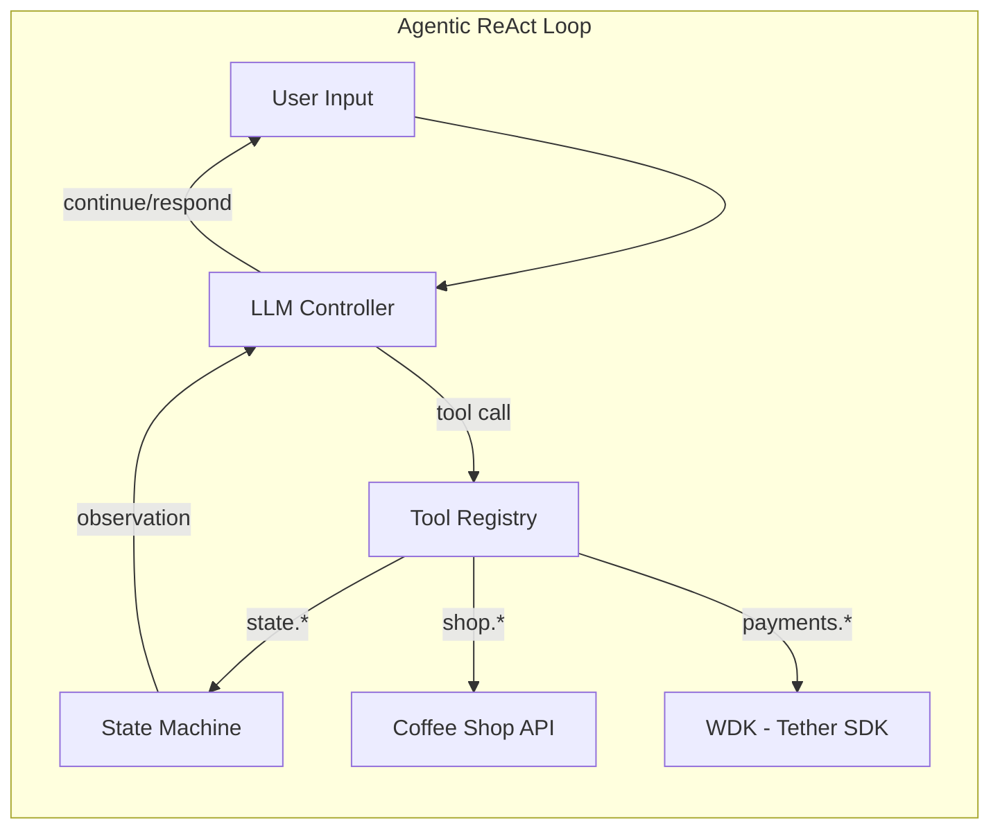
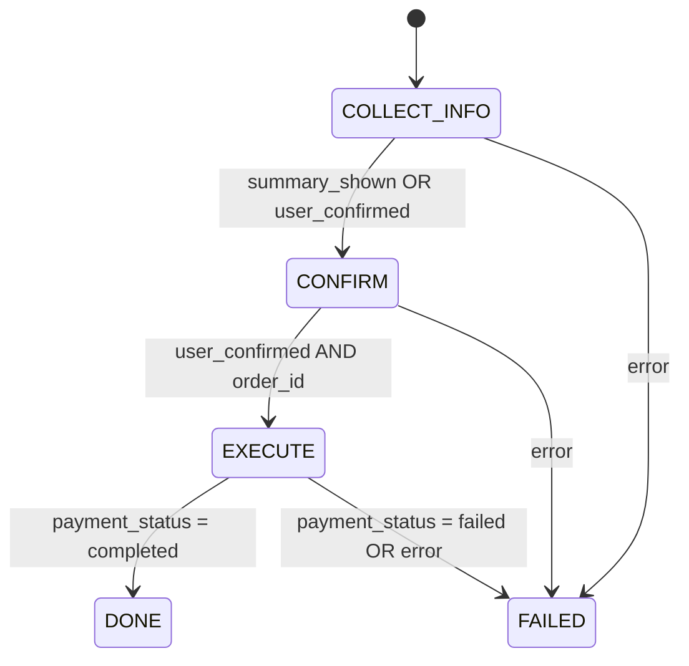
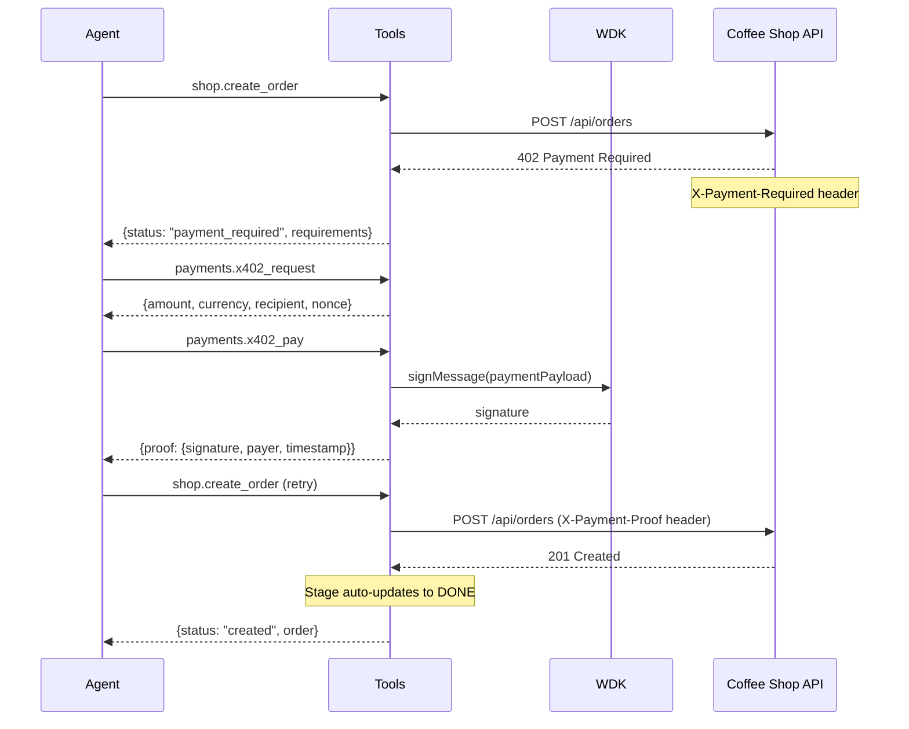
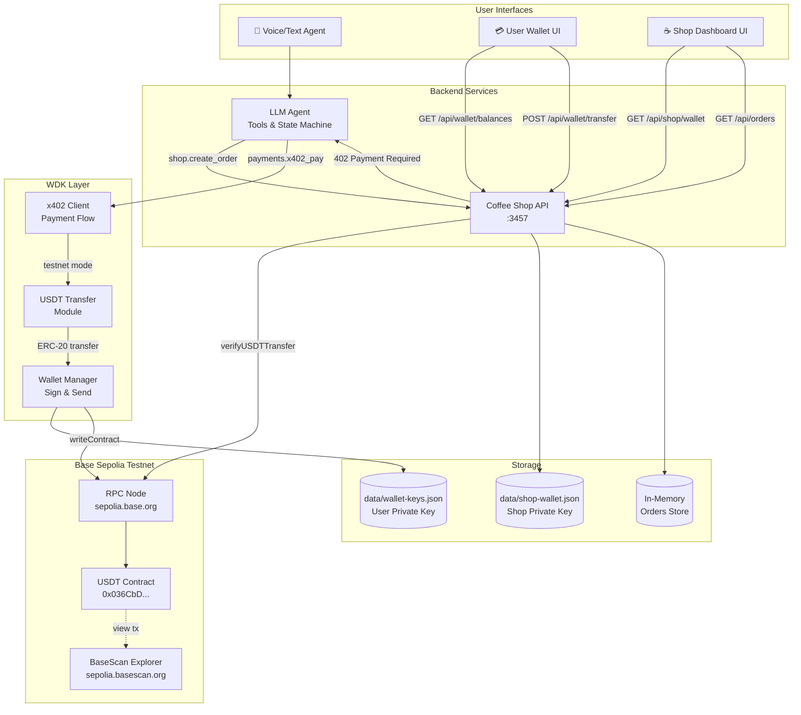
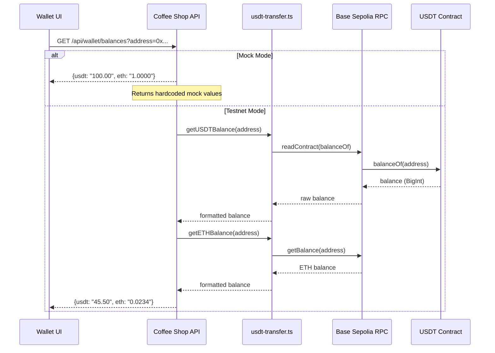

# ☕ Agentic Coffee Ordering Assistant

A fully agentic (LLM-driven) coffee ordering assistant built with the QVAC SDK. Uses a ReAct-style architecture where the LLM controller navigates a typed state machine through tool calls, with **real USDT payments** via Tether's WDK SDK.

## 🚀 Real Blockchain Payments

This assistant can execute **real USDT transactions** on testnet:

```bash
# Enable real payments
USE_REAL_PAYMENTS=true bun run dev
```

When enabled, payments are sent via the official **Tether WDK SDK** supporting:
- 🔷 **Tron** (Nile testnet) - Recommended for USDT
- ⬡ **Ethereum** (Sepolia testnet)
- ₿ **Bitcoin** (testnet)
- ◎ **Solana** (devnet)

## Architecture Overview



### Key Design Principles

1. **LLM as Controller**: The model chooses actions via tool calls - not deterministic FSM transitions
2. **Tool-Mediated State**: All state mutations happen through `state.patch` - never assumed
3. **Auto-Synced FSM**: Stage transitions happen automatically based on state conditions after each patch
4. **Payment Gating**: Payment tools only callable when requirements are met (enforced in runtime)
5. **Turn Budget**: Hard limit of 25 turns with actionable error messages

## FSM State Transitions



Stage transitions are **automatic** - the FSM updates after every `state.patch` based on:
- `DONE`: `payment_status === "completed"` AND `order_id` exists
- `FAILED`: `payment_status === "failed"` OR `error` exists  
- `EXECUTE`: `user_confirmed` AND `order_id` exists
- `CONFIRM`: `summary_shown` OR `user_confirmed`
- `COLLECT_INFO`: default

## Quick Start

### 1. Install Dependencies

```bash
cd qvac-coffee-assistant
bun install
```

### 2. Configure Environment

The project uses two separate environment files for the QVAC agent and Coffee Shop API:

```bash
# Run the setup script to create both env files
./scripts/setup-models.sh

# This creates:
#   .env.qvac   - QVAC agent config (copied from .envBTC)
#   .env.coffee - Coffee Shop API config (copied from .env.example)

# Or manually copy the example files:
cp .envBTC .env.qvac
cp .env.example .env.coffee

# Edit each file as needed for your setup
```

### 3. Start the Coffee Shop API

```bash
# For QVAC agent (uses .env.qvac)
bun run qvac-api

# For Coffee agent (uses .env.qvac)
bun run coffee-api
```

### 4. Run the Web UI (Recommended)

The interactive web interface provides a visual experience with real-time updates:

```bash
# Start the Agent UI Server (in a new terminal)
bun run ui

# Open browser
open http://localhost:3458
```

**Web UI Features:**
- 🎤 Voice input with browser microphone
- 🔊 TTS audio playback in browser
- ⚡ Real-time tool call visualization with flickering effect
- 🔵 State machine spheres showing agent progression
- 📱 QR code displayed inline in chat when order completes
- 💬 Filler speech while agent processes
- 📋 Order details populated in real-time
- 🌐 **Multilingual support** - English and Spanish with localized TTS, STT, and UI

### 5. Run the QVAC Personal Assistant (Voice-First UI)

A minimal, voice-first personal assistant interface:

```bash
# Start the QVAC Agent Server (in a new terminal)
bun run qvac

# Open browser
open http://localhost:3459
```

**QVAC Agent Features:**
- 🎙️ Voice-first interface - centered QVAC logo with waveform visualizer
- 🌊 Animated waveform that responds to TTS audio playback
- 💬 Transient status messages (no persistent chat transcript)
- 🔄 Processing indicator with 3-dot animation
- 📱 Clickable QR code receipt after order completion
- 🗣️ Contextual filler speech during tool calls
- ⚙️ Configuration panel with TTS voice selection

**Key Difference from Coffee Agent:**
The QVAC agent is framed as your **personal assistant** that helps you order from BitCafe, rather than being the coffee shop itself. It says things like "I found BitCafe nearby, would you like to order from there?" instead of "Welcome to the coffee shop."

### 6. Run the CLI Voice Assistant

For terminal-based voice interaction:

```bash
bun run dev
```

### 7. Run the Test Harness (Text Mode)

The test harness automatically loads the LLM model and tracks FSM state transitions.

```bash
# Interactive mode
bun run test:agent

# Run predefined scenarios
bun run test:agent -- --scenario simple
bun run test:agent -- --scenario dense
bun run test:agent -- --scenario edge

# List available scenarios
bun run test:agent -- --list
```

### 8. Access the Shop/Wallet UIs

The Coffee Shop API includes web interfaces for testing and demonstration:

```bash
# Shop Dashboard - manage orders and view shop wallet
open http://localhost:3457/shop/

# User Wallet - simulate payments and USDT transfers
open http://localhost:3457/wallet/
```

### 9. Download High-Quality TTS Voices (Optional)

For better voice quality than the default, download Piper neural TTS voices:

```bash
# Download all voices (Ryan + Semaine, ~140MB total)
bun run download:voices

# Or download a specific voice
bun run download:voices -- --voice ryan     # US English male
bun run download:voices -- --voice semaine  # British English female

# Set your preferred voice
export TTS_VOICE=ryan
```

### 10. Multilingual Support (English & Spanish)

The assistant supports **full Spanish language mode** with localized voice, transcription, and responses.

**How to Use:**

1. Start the Web UI: `bun run ui`
2. Click "Start Agent"
3. Select your language: **English** or **Español**
4. Speak in your selected language!

**What's Localized:**

| Component | English | Spanish |
|-----------|---------|---------|
| **Speech-to-Text** | Whisper (multilingual) | Whisper (Spanish transcription) |
| **Text-to-Speech** | Ryan/Semaine/Norman | Sharvard (es_ES) |
| **LLM System Prompt** | English instructions | Spanish instructions |
| **Filler Speech** | "Let me check..." | "Déjame revisar..." |
| **Confirmation Messages** | "Your order is complete!" | "¡Tu pedido está completo!" |
| **Loading Status** | "Loading models..." | "Cargando modelos..." |
| **Menu Recognition** | "latte", "americano" | "café con leche", "café americano" |

**Spanish Menu Aliases:**

The menu supports Spanish drink names as aliases:

| English Name | Spanish Alias |
|--------------|---------------|
| Latte | café con leche |
| Americano | café americano |
| Espresso | café expreso |
| Cappuccino | capuchino |
| Mocha | moca |
| Macchiato | macchiato |

**Technical Details:**

- Whisper uses `language: "es"` and `translate: false` to transcribe Spanish speech without translation
- Spanish TTS uses Piper's `sharvard` voice (es_ES medium quality)
- The LLM prompt includes Spanish-specific tool call examples and reminders
- All agent status messages are localized based on the selected language

## Web UIs

### QVAC Agent UI (`bun run qvac` → `localhost:3459`)

A minimal, voice-first personal assistant interface:

- **Voice-First Design**: Large centered QVAC logo with animated waveform visualizer
- **Transient Messages**: Status messages appear and fade - no persistent chat transcript
- **Processing Indicator**: Subtle 3-dot animation while the LLM is thinking
- **Waveform Visualizer**: Symmetric, centered waveform that animates with TTS audio
- **Clickable QR Receipt**: After order completion, QR code links directly to receipt
- **Personal Assistant Framing**: "I found BitCafe nearby" vs "Welcome to the coffee shop"

**Technical Details:**
- WebSocket connection on port 3459
- Same underlying agent tools as Coffee Agent
- QVAC-specific filler phrases ("Let me help you with that...")
- Starter filler plays immediately after user speaks

### Coffee Agent UI (`bun run ui` → `localhost:3458`)

The primary interactive interface for the coffee ordering agent:

- **Configuration Panel**: Adjust settings before starting (API URL, model paths, payment options)
- **Conversation Area**: Messages displayed with typewriter effect as agent responds
- **State Machine Visualization**: Animated spheres showing progression (COLLECT_INFO → CONFIRM → EXECUTE → DONE)
  - Active state: amber pulsing
  - Completed states: green
  - Failed state: all spheres turn red
- **Order Details Panel**: Real-time population of drink, extras, and pricing
- **Tool Call Indicators**: Grey boxes with flickering effect showing tool execution
  - Displays friendly names (e.g., "Checking for missing fields" instead of `state.missing_fields`)
  - Amber border while calling, green when completed
- **Voice Input**: Browser microphone recording with ScriptProcessorNode for raw PCM capture
- **TTS Playback**: Agent responses spoken via Web Audio API
- **Filler Speech**: Contextual audio feedback during agent processing ("Let me check on that...")
- **QR Code in Chat**: Order confirmation QR displayed inline as assistant message

**Technical Details:**
- WebSocket connection for real-time bidirectional updates
- Raw 16kHz PCM audio capture with client-side resampling
- Base64-encoded WAV audio streaming for TTS

### Shop Dashboard (`/shop/`)

A real-time order management dashboard for the coffee shop:

- **Order Tracking**: View all orders with status filtering (All, Pending, Paid, Preparing, Completed)
- **Order Management**: Accept payments, update order status (Preparing → Ready → Complete)
- **Shop Wallet**: Display shop's USDT and ETH balances with one-click copy address
- **Live Updates**: Auto-refreshes orders every 5 seconds

### User Wallet (`/wallet/`)

A wallet interface for simulating end-to-end USDT payments:

- **Wallet Display**: Shows address, USDT balance, and ETH balance (for gas)
- **Send USDT**: Transfer USDT to any address with "Paste Shop Address" helper
- **Transaction History**: View recent transactions (stored locally)
- **Mode Toggle**: Switch between Mock and Testnet modes
- **Faucet Links**: Quick access to get test ETH and USDC on Base Sepolia

## Tool API

The agent has access to 11 tools:

### State Tools
| Tool | Description |
|------|-------------|
| `state.get` | Returns full current state |
| `state.patch` | Updates state with provided patch (auto-updates FSM stage) |
| `state.missing_fields` | Returns list of missing required fields |
| `state.advance_if_ready` | Explicitly advances stage if requirements met |
| `state.summary` | Human-readable order summary |

### Profile Tools
| Tool | Description |
|------|-------------|
| `profile.get_defaults` | Returns saved user preferences (name, address, currency) |

### Shop Tools
| Tool | Description | Gating |
|------|-------------|--------|
| `shop.get_quote` | Gets price quote from API | None |
| `shop.create_order` | Creates order (may return 402) | All fields + confirmed |
| `shop.complete_with_payment` | Submits order with payment proof | Proof + requirements exist |

**Note:** When orders are successfully placed, QR codes are automatically generated if `ENABLE_QR_CODE=true` in `.env`. The QR code displays in terminal (ASCII art) and in the Web UI as an inline chat message with order details.

### Payment Tools
| Tool | Description | Gating |
|------|-------------|--------|
| `payments.x402_request` | Returns x402 payment requirements | 402 received |
| `payments.x402_pay` | Creates payment proof via WDK | Requirements exist |

## State Shape

```typescript
interface AgentState {
  stage: "COLLECT_INFO" | "CONFIRM" | "EXECUTE" | "DONE" | "FAILED"
  user: { name?: string; name_confirmed: boolean }
  fulfillment: { mode: "pickup" }
  order: { drink?: string; options?: string[] }  // options are IDs like ["almond-milk", "caramel"]
  payment: { currency: PaymentCurrency; ready: boolean }
  confirmation: { user_confirmed: boolean; summary_shown: boolean }
  execution: { 
    order_id?: string
    payment_status?: "pending" | "processing" | "completed" | "failed"
    payment_proof?: string
    x402_requirements?: X402Requirements
    idempotency_key?: string
    error?: string
  }
  counters: { turns_total: number; max_turns_total: number }
}
```

## Menu

The coffee shop offers **16 drinks** across 4 categories, plus **4 extras** ($0.50 each):

**Drinks:**
- **Espresso**: Specialty Espresso ($2.50), Americano ($3.00), Ristretto ($2.75), Lungo ($3.00)
- **Espresso & Milk**: Cappuccino ($3.50), Latte ($3.50), Flat White ($3.50), Macchiato ($3.25), Moccaccino ($4.00), Chai Espresso ($4.00)
- **Iced**: Iced Coffee ($3.50), Iced Latte ($4.00), Cascara ($4.00), Espresso Tonic ($4.50), Iced Chocolate ($4.00)
- **Other**: Hot Chocolate ($3.50)

**Extras** (add to any drink):
- Espresso Shot (+$0.50)
- Almond Milk (+$0.50)
- Chocolate (+$0.50)
- Caramel (+$0.50)

**Visual Menu Display:** When users ask to see the menu, it's displayed visually in the UI (not read aloud by TTS). The agent simply says "Here's the menu" while the full menu appears on screen.

## Agent Policy

The LLM follows this workflow:

1. Call `profile.get_defaults` to get saved preferences
2. Extract all information from user message
3. Call `state.patch` with extracted data (includes actual values, not just confirmations)
4. Call `state.missing_fields` to check completeness
5. If fields missing → Ask ONE focused follow-up question
6. If complete → Call `state.summary` and ask for confirmation
7. After user confirms → Set `confirmation.user_confirmed: true` via `state.patch`
8. Proceed to `shop.get_quote` → `shop.create_order` → payment flow

## WDK Integration

The project uses **Tether's official WDK SDK** (`@tetherto/wdk`) for multi-chain wallet operations:

### Supported Chains
| Chain | Network | Use Case |
|-------|---------|----------|
| **Tron** | Nile Testnet | USDT payments (recommended) |
| **Ethereum** | Sepolia | EVM payments |
| **Bitcoin** | Testnet | BTC payments |
| **Solana** | Devnet | SOL payments |

### Architecture

```
tether-wdk/
├── wdk-manager.ts      # TetherWDKManager - multi-chain wallet
├── payment-processor.ts # Payment processing utilities
└── index.ts            # Exports
```

### Usage

```typescript
import { getTetherWDK } from "../tether-wdk"

// Initialize multi-chain wallet
const wdkManager = getTetherWDK({
  networks: {
    ethereum: 'https://ethereum-sepolia-rpc.publicnode.com',
    tron: 'https://nile.trongrid.io',
    bitcoin: { network: 'testnet', host: 'blockstream.info', port: 443 },
    solana: { rpcUrl: 'https://api.devnet.solana.com' }
  }
})

// Get addresses
const ethAddress = await wdkManager.getAddress('ethereum', 0)
const tronAddress = await wdkManager.getAddress('tron', 0)

// Send USDT payment
await wdkManager.sendTransaction('tron', {
  to: merchantAddress,
  token: 'TXYZopYRdj2D9XRtbG411XZZ3kM5VkAeBf', // Tron Nile USDT
  value: BigInt(5_000_000) // 5 USDT (6 decimals)
}, 0)
```

### Agent Integration

```typescript
// Pass both wdkContext (for signatures) and wdkManager (for real transactions)
agent.setupWDK(wdkContext, wdkManager)
```

## Real Blockchain Payments

The assistant supports **real USDT payments on testnet** using Tether's WDK SDK.

### Quick Setup

```bash
# 1. Enable real payments in .env.qvac (or .env.coffee)
USE_REAL_PAYMENTS=true
PAYMENT_NETWORK=tron-nile
PAYMENT_RECIPIENT=TVyMXBMZUEbf2TCTfSBah9W44oB9678tyW

# 2. Start the API server
bun run qvac-api   # For QVAC agent
# or
bun run coffee-api # For Coffee agent

# 3. Run the assistant
bun run dev
```

### Step-by-Step Guide

#### 1. Configure Environment

Edit `.env` to enable real payments:

```bash
# Enable real blockchain transactions
USE_REAL_PAYMENTS=true

# Merchant wallet (receives payments)
PAYMENT_RECIPIENT=TVyMXBMZUEbf2TCTfSBah9W44oB9678tyW

# Payment network
PAYMENT_NETWORK=tron-nile
PAYMENT_CURRENCY=USDT
```

#### 2. Fund Your Wallet

On first run, a seed phrase is auto-generated and saved to `data/tether-wdk-seed.json`.

Get test tokens for your wallet address:

| Network | Token | Faucet |
|---------|-------|--------|
| **Tron Nile** | TRX + USDT | [nileex.io](https://nileex.io/) |
| **Base Sepolia** | ETH | [Alchemy Faucet](https://www.alchemy.com/faucets/base-sepolia) |
| **Base Sepolia** | USDC | [Circle Faucet](https://faucet.circle.com/) |
| **Ethereum Sepolia** | ETH | [sepoliafaucet.com](https://sepoliafaucet.com/) |

#### 3. Start the Server

```bash
# Start Coffee Shop API for QVAC agent (uses .env.qvac)
bun run qvac-api

# Start Coffee Shop API for Coffee agent (uses .env.qvac)
bun run coffee-api

# Or with testnet x402 mode (uses .env.coffee)
bun run api:testnet
```

#### 4. Run with Real Payments

```bash
# Voice assistant
bun run dev

# Or test harness
bun run test:agent
```

### Example: Real Payment Flow

```
You: "I'd like a latte with almond milk"
Assistant: "Great choice! What name for the order?"

You: "Omar"
Assistant: "Latte with almond milk for Omar. Total: 4.00 USDT. Shall I confirm?"

You: "Yes, confirm"
Assistant: "Processing payment..."

💸 Sending REAL blockchain payment...
   Amount: 4.00 USDT
   To: TVyMXBMZUEbf2TCTfSBah9W44oB9678tyW

✅ Transaction sent! Hash: 4cce34fb...
   View: https://nile.tronscan.org/#/transaction/4cce34fb...

## Demo Scenarios

### Simple Order (3 turns)

```
USER: "I want to order a latte"
AGENT: [calls state.patch_and_check with order.drink="latte"]
AGENT: "Great choice! What name for the order?"

USER: "Omar"
AGENT: [calls state.patch_and_check with user.name="Omar"]
       [calls state.summary]
AGENT: "Here's your order: Latte for Omar. Total: 3.50 USDT. Shall I confirm?"

USER: "Yes, confirm the order"
AGENT: [calls state.confirm_order]
       [calls shop.create_and_pay] -> handles quote, order, and payment
AGENT: "Order complete! Pick up your coffee at BitCafe."
```

### Order with Extras (2 turns)

```
USER: "I'd like a latte with almond milk and caramel, name is Omar"
AGENT: [calls state.patch_and_check with order.drink="latte", order.options=["almond-milk", "caramel"], user.name="Omar"]
       [calls state.summary]
AGENT: "Latte with Almond Milk and Caramel for Omar. Total: 4.50 USDT. Confirm?"

USER: "Yes"
AGENT: [calls state.confirm_order, shop.create_and_pay]
AGENT: "Order complete!"
```

## Test Harness Features

The test harness (`examples/test-harness.ts`) provides:

- **FSM Tracking**: Visual display of stage transitions as they happen
- **Tool Call Logging**: Shows each tool call and its result
- **State Display**: Compact view of current state after each turn
- **Timeout Handling**: 60s timeout per turn with graceful error handling
- **Auto Model Loading**: Loads LLM model on startup, unloads on exit
- **Scenario Support**: Predefined test scenarios for validation

```
┌──────────────────────────────────────────────────────────────┐
│ ✅ Stage: DONE         | Turns: 8/25  | 📝○ → ✋○ → ⚡○ → ✅◀│
├──────────────────────────────────────────────────────────────┤
│ Order: latte + almond-milk, caramel                          │
│ Name: Omar                                                   │
│ Confirmed: YES | Payment: PAID | Order: ORD-2026-0001       │
└──────────────────────────────────────────────────────────────┘
```

## Project Structure

```
qvac-coffee-assistant/
├── agent/
│   ├── index.ts           # CoffeeAgent class with ReAct loop
│   ├── types.ts           # AgentState, Tool, Stage interfaces
│   ├── tools.ts           # All 11 tool implementations (with real payment support)
│   ├── llm-adapter.ts     # System prompt, tool call parsing
│   └── user-profile.ts    # User profile management
├── tether-wdk/            # 🆕 Official Tether WDK integration
│   ├── index.ts           # Exports
│   ├── wdk-manager.ts     # TetherWDKManager - multi-chain wallet
│   └── payment-processor.ts # Payment processing utilities
├── coffee-shop-api/
│   ├── server.ts          # Coffee shop API with x402 gate + static file serving
│   ├── wallet.ts          # Shop wallet management
│   ├── data/menu.ts       # Menu and store data
│   └── public/            # Shop Dashboard UI (HTML/CSS/JS)
│       ├── index.html
│       ├── shop.css
│       └── shop.js
├── wallet-ui/             # User Wallet UI (HTML/CSS/JS)
│   ├── index.html
│   ├── wallet.css
│   └── wallet.js
├── scripts/
│   ├── generate-wallet.ts       # Wallet key generation
│   └── download-tts-voices.ts   # Download Piper TTS voices
├── qvac-agent/            # 🆕 QVAC Personal Assistant
│   ├── qvac-server.ts     # WebSocket server for QVAC UI
│   ├── qvac-agent.ts      # QVAC agent wrapper with personal assistant prompt
│   ├── filler-phrases.ts  # QVAC-specific filler phrases
│   └── public/            # Voice-first UI
│       ├── qvac-ui.html   # Minimal interface with waveform
│       └── styles/qvac-ui.css
├── examples/
│   ├── test-harness.ts    # Text-based testing CLI with FSM tracking
│   ├── agent-ui-server.ts # Coffee Agent WebSocket server
│   ├── filler-speech.ts   # Coffee agent filler phrases (EN/ES)
│   └── coffee-voice-control.ts  # Voice assistant
├── tests/
│   ├── agent.test.ts      # Agent unit tests
│   └── wdk.test.ts        # WDK module tests
├── data/
│   ├── user-profile.json  # Saved user preferences
│   ├── wallet-keys.json   # User wallet keys (git-ignored)
│   └── shop-wallet.json   # Shop wallet keys (git-ignored)
├── models/
│   ├── Qwen3-4B-Instruct-2507-Q8_0.gguf  # LLM model
│   └── tts/               # TTS voice models (downloaded)
│       ├── en_US-ryan-high.onnx
│       └── en_GB-semaine-medium.onnx
├── logs/
│   └── audit.log          # Audit trail
├── .env.example           # Environment template (for .env.coffee)
├── .envBTC                # Bitcoin Lightning template (for .env.qvac)
├── .env.qvac              # QVAC agent config (git-ignored)
└── .env.coffee            # Coffee agent config (git-ignored)
```

## Security: Wallet Keys

⚠️ **The wallet key files are in `.gitignore` for security reasons:**

### Why Wallet Keys Should Never Be Committed

1. **Private Key Exposure**: The `wallet-keys.json` and `shop-wallet.json` files contain **private keys** that give full control of the wallet. If someone gets your private key, they can steal all funds, sign transactions as you, and impersonate the wallet owner.

2. **Git History is Permanent**: Even if you delete a file later, it remains in git history forever. Anyone who clones the repo can access old commits and extract the keys.

3. **Different Keys Per Environment**: Each developer/deployment should have their own wallet:
   - **Local development**: Mock or testnet wallet with test funds
   - **Staging**: Different testnet wallet
   - **Production**: Never committed, managed via secrets manager

### Wallet File Structure

```json
{
  "mnemonic": "twelve word seed phrase...",
  "privateKey": "0x...",
  "address": "0x...",
  "createdAt": "..."
}
```

### Best Practices

- **Testnet**: Generate a fresh wallet using `bun run generate:wallet`
- **Production**: Use environment variables or a secrets manager
- **Never commit** real keys, even for "test" wallets (they might accumulate real value)

The wallet files are auto-generated on first run, so each clone gets fresh wallets.

## Environment Variables

The project uses two separate environment files:

| File | Used By | Source Template |
|------|---------|-----------------|
| `.env.qvac` | QVAC agent (`bun run qvac`, `bun run qvac-api`) | `.envBTC` |
| `.env.coffee` | Coffee agent (`bun run coffee-api`, `bun run api:testnet`) | `.env.example` |

```bash
# Create both env files using the setup script
./scripts/setup-models.sh

# Or manually copy the templates
cp .envBTC .env.qvac
cp .env.example .env.coffee
```

| Variable | Description | Default |
|----------|-------------|---------|
| **Real Payments** | | |
| `USE_REAL_PAYMENTS` | Enable real blockchain transactions | `false` |
| `PAYMENT_RECIPIENT` | Merchant wallet address | Tron Nile address |
| `PAYMENT_NETWORK` | Payment network (`tron-nile`, `base-sepolia`) | `tron-nile` |
| `PAYMENT_CURRENCY` | Payment currency | `USDT` |
| **Coffee Shop API** | | |
| `COFFEE_SHOP_API_URL` | Coffee Shop API endpoint | `http://localhost:3457` |
| **Features** | | |
| `ENABLE_QR_CODE` | Generate QR codes for orders (terminal + browser) | `false` |
| **Models** | | |
| `LLM_MODEL_PATH` | Path to Qwen model (GGUF) | - |
| `TTS_VOICE` | TTS voice: `ryan`, `semaine`, `norman` (EN) or `sharvard` (ES) | `norman` |
| `TTS_MODEL_DIR` | Directory for TTS models | `models/tts` |
| `ESPEAK_DATA_PATH` | Path to eSpeak data (for phonemization) | - |
| **Tether WDK** | | |
| `WDK_MODE` | WDK mode: `mock` or `testnet` | `mock` |
| `WDK_NETWORK` | EVM chain network | `base-sepolia` |
| `WDK_SEED_PHRASE` | Wallet seed phrase (auto-generated if not set) | - |

See [`.env.example`](.env.example) for full configuration options with comments, or [`.envBTC`](.envBTC) for Bitcoin Lightning configuration.

## Prerequisites

### Required

- **Bun** >= 1.0.0 - JavaScript runtime and package manager
- **Node.js** >= 18.0.0 - Required for some dependencies

### For Voice Mode (Optional)

- **FFmpeg** - Audio processing
- **eSpeak-ng** - Phonemization engine (required for all Piper voices)
- **Piper Voice Models** - High-quality neural TTS voices (Ryan, Semaine)

### Installation

#### macOS (Homebrew)

```bash
# Install Bun
curl -fsSL https://bun.sh/install | bash

# Install FFmpeg and eSpeak for voice mode
brew install ffmpeg espeak-ng

# Set eSpeak data path (add to ~/.zshrc)
export ESPEAK_DATA_PATH="/opt/homebrew/Cellar/espeak-ng/1.52.0/share/espeak-ng-data"
```

#### Linux (Ubuntu/Debian)

```bash
# Install Bun
curl -fsSL https://bun.sh/install | bash

# Install FFmpeg and eSpeak for voice mode
sudo apt update
sudo apt install ffmpeg espeak-ng
```

#### Download LLM Model

The agent requires a Qwen model for the LLM controller:

Models are automatically downloaded when you run `bun install`. To download manually:

```bash
# Download all models (LLM + TTS voices)
bun run setup:models

# Or download just the LLM
bun run setup:models -- --skip-tts

# Or manually with curl (~4.3GB)
curl -L -o models/Qwen3-4B-Instruct-2507-Q8_0.gguf \
  "https://huggingface.co/unsloth/Qwen3-4B-Instruct-2507-GGUF/resolve/main/Qwen3-4B-Instruct-2507-Q8_0.gguf"
```

To skip model downloads during install (e.g., in CI):

```bash
SKIP_MODEL_DOWNLOAD=1 bun install
```

#### Download TTS Voices (Optional)

For higher-quality text-to-speech voices, download Piper neural TTS models from Hugging Face:

```bash
# View available voices and download options
bun run download:voices -- --help

# Download all voices (Ryan + Semaine, ~140MB total)
bun run download:voices

# Or download specific voice
bun run download:voices -- --voice ryan
bun run download:voices -- --voice semaine
```

**What Gets Downloaded:**

The script downloads voice models to `models/tts/`:

```
models/tts/
├── en_US-ryan-high.onnx        # Ryan voice model (~75MB)
├── en_US-ryan-high.onnx.json   # Ryan config
├── en_GB-semaine-medium.onnx   # Semaine voice model (~65MB)
└── en_GB-semaine-medium.onnx.json  # Semaine config
```

**Available Voices:**

| Voice | Language | Description | Quality | Size | Source |
|-------|----------|-------------|---------|------|--------|
| `ryan` | English (US) | Male, warm and friendly | High (22kHz, 32M params) | ~75MB | [Hugging Face](https://huggingface.co/rhasspy/piper-voices/tree/main/en/en_US/ryan/high) |
| `semaine` | English (UK) | Female, expressive | Medium (22kHz, 20M params) | ~65MB | [Hugging Face](https://huggingface.co/rhasspy/piper-voices/tree/main/en/en_GB/semaine/medium) |
| `norman` | English (US) | Male (SDK default) | Medium (22kHz, 20M params) | Bundled | Included in @qvac/sdk |
| `sharvard` | **Spanish (ES)** | Male, clear articulation | Medium (22kHz, 20M params) | ~65MB | [Hugging Face](https://huggingface.co/rhasspy/piper-voices/tree/main/es/es_ES/sharvard/medium) |

**Using a Downloaded Voice:**

Set the `TTS_VOICE` environment variable before running the voice assistant:

```bash
# In your terminal
export TTS_VOICE=ryan
bun run dev

# Or inline
TTS_VOICE=ryan bun run dev

# Or add to your .env file
echo "TTS_VOICE=ryan" >> .env
```

**Manual Download (Alternative):**

If the script doesn't work, you can manually download from Hugging Face:

```bash
# Create the TTS models directory
mkdir -p models/tts

# Download Ryan (high quality)
curl -L -o models/tts/en_US-ryan-high.onnx \
  "https://huggingface.co/rhasspy/piper-voices/resolve/main/en/en_US/ryan/high/en_US-ryan-high.onnx"
curl -L -o models/tts/en_US-ryan-high.onnx.json \
  "https://huggingface.co/rhasspy/piper-voices/resolve/main/en/en_US/ryan/high/en_US-ryan-high.onnx.json"

# Download Semaine (medium quality)
curl -L -o models/tts/en_GB-semaine-medium.onnx \
  "https://huggingface.co/rhasspy/piper-voices/resolve/main/en/en_GB/semaine/medium/en_GB-semaine-medium.onnx"
curl -L -o models/tts/en_GB-semaine-medium.onnx.json \
  "https://huggingface.co/rhasspy/piper-voices/resolve/main/en/en_GB/semaine/medium/en_GB-semaine-medium.onnx.json"

# Download Sharvard - Spanish voice (medium quality)
curl -L -o models/tts/es_ES-sharvard-medium.onnx \
  "https://huggingface.co/rhasspy/piper-voices/resolve/main/es/es_ES/sharvard/medium/es_ES-sharvard-medium.onnx"
curl -L -o models/tts/es_ES-sharvard-medium.onnx.json \
  "https://huggingface.co/rhasspy/piper-voices/resolve/main/es/es_ES/sharvard/medium/es_ES-sharvard-medium.onnx.json"
```

> **Note**: eSpeak-ng is still required for all Piper voices - it's used internally for phonemization 
> (text-to-phoneme conversion), not for the actual voice synthesis. The voice quality you hear comes 
> from the neural network model (Ryan/Semaine/Sharvard), not eSpeak.

## NPM Scripts

| Script | Description |
|--------|-------------|
| `bun run qvac-api` | Start Coffee Shop API for QVAC agent (uses `.env.qvac`) |
| `bun run coffee-api` | Start Coffee Shop API for Coffee agent (uses `.env.coffee`) |
| `bun run api:testnet` | Start server in testnet mode (real USDT transfers, uses `.env.coffee`) |
| `bun run ui` | Start Coffee Agent Web UI server (port 3458) |
| `bun run qvac` | Start QVAC Personal Assistant UI server (port 3459, uses `.env.qvac`) |
| `bun run test:agent` | Run interactive test harness |
| `bun run dev` | Run CLI voice assistant |
| `bun run generate:wallet` | Generate new wallet keys |
| `bun run download:voices` | Download TTS voice models |
| `bun test` | Run unit tests |
| `bun run typecheck` | Type check the codebase |

## Testing

```bash
# Run test harness in interactive mode
bun run test:agent

# Run with scenario
bun run test:agent -- --scenario simple

# Run unit tests
bun test

# Type check
bun run typecheck
```

## Payment Flow (x402)



## End-to-End System Architecture

This diagram shows the complete flow from user interaction to on-chain USDT transfer:



## How Wallet Balance Checking Works

### User Wallet vs Shop Wallet

Both wallets work identically but serve different purposes:

| Aspect | User Wallet | Shop Wallet |
|--------|-------------|-------------|
| **File** | `data/wallet-keys.json` | `data/shop-wallet.json` |
| **Purpose** | Send USDT payments | Receive USDT payments |
| **API Endpoint** | `GET /api/wallet/balances?address=...` | `GET /api/shop/wallet` |
| **UI** | `/wallet/` | `/shop/` |
| **Needs ETH** | Yes (to pay gas for transfers) | No (only receives) |
| **Needs USDT** | Yes (to pay for orders) | Accumulates from payments |

### Balance Fetching Flow



### Code Path for Balance Checks

**Mock Mode** (`X402_MODE=mock`):
```typescript
// server.ts - Returns fake balances instantly
if (X402_MODE === "mock") {
  return { usdt: "100.00", eth: "1.0000" }
}
```

**Testnet Mode** (`X402_MODE=testnet`):
```typescript
// usdt-transfer.ts - Reads from blockchain
const balance = await publicClient.readContract({
  address: USDT_CONTRACT_ADDRESS,
  abi: ERC20_ABI,
  functionName: "balanceOf",
  args: [address],
})
return formatUnits(balance, 6)  // USDT has 6 decimals
```

## Verifying On-Chain Transactions

### How to Confirm a Transaction is Real

When a USDT transfer happens in testnet mode, you get a **transaction hash** like:
```
0x<your-transaction-hash>
```

### 1. View in Block Explorer

Navigate to:
```
https://sepolia.basescan.org/tx/{transactionHash}
```

You'll see:
- **From**: User wallet address
- **To**: USDT contract address
- **Method**: `transfer(address,uint256)`
- **Tokens Transferred**: Amount of USDT moved
- **Status**: Success/Failed
- **Block**: Confirmation block number

### 2. Programmatic Verification

The server verifies payments on-chain:

```typescript
// wdk/usdt-transfer.ts
const verifyUSDTTransfer = async (txHash, expectedTo, expectedAmount) => {
  // 1. Get transaction receipt
  const receipt = await publicClient.getTransactionReceipt({ hash: txHash })
  
  // 2. Check transaction succeeded
  if (receipt.status !== "success") return { valid: false }
  
  // 3. Find the Transfer event in logs
  const transferLog = receipt.logs.find(log =>
    log.address === USDT_CONTRACT &&
    log.topics[0] === TRANSFER_EVENT_TOPIC
  )
  
  // 4. Decode and verify recipient & amount
  const to = "0x" + transferLog.topics[2].slice(26)
  const amount = BigInt(transferLog.data)
  
  return {
    valid: to === expectedTo && amount >= expectedAmount,
    from, to, amount, blockNumber
  }
}
```

### 3. In the UIs

**User Wallet UI** (`/wallet/`):
- After sending USDT, the transaction hash is displayed
- Click to open in BaseScan explorer
- Balance updates after ~2-3 seconds (block confirmation)

**Shop Dashboard UI** (`/shop/`):
- Orders show payment proof with transaction hash
- Shop wallet balance increases after payment
- Refresh button fetches latest on-chain balance

### Quick Verification Checklist

| Check | How to Verify |
|-------|---------------|
| Transaction exists | Search tx hash on [BaseScan](https://sepolia.basescan.org) |
| Correct recipient | Compare "To" with shop wallet address |
| Correct amount | Check "Tokens Transferred" matches order total |
| Confirmed | Status shows "Success" |
| User balance decreased | Refresh User Wallet UI |
| Shop balance increased | Refresh Shop Dashboard |

## License

ISC