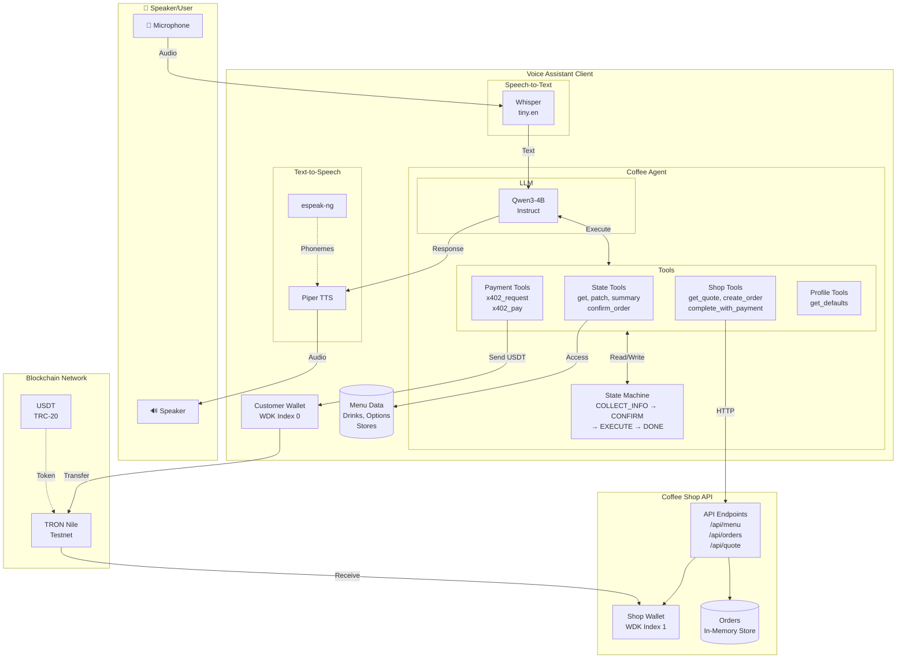
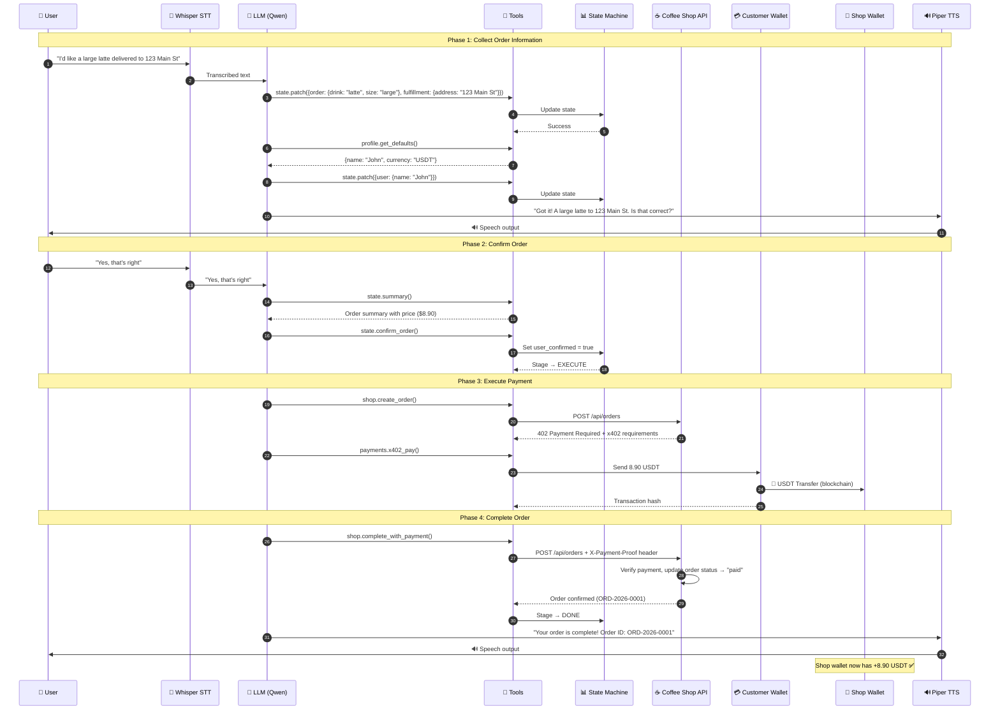
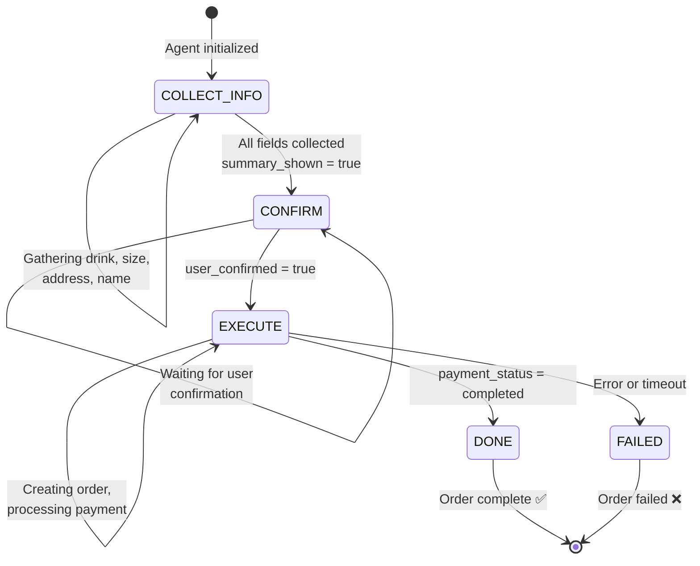
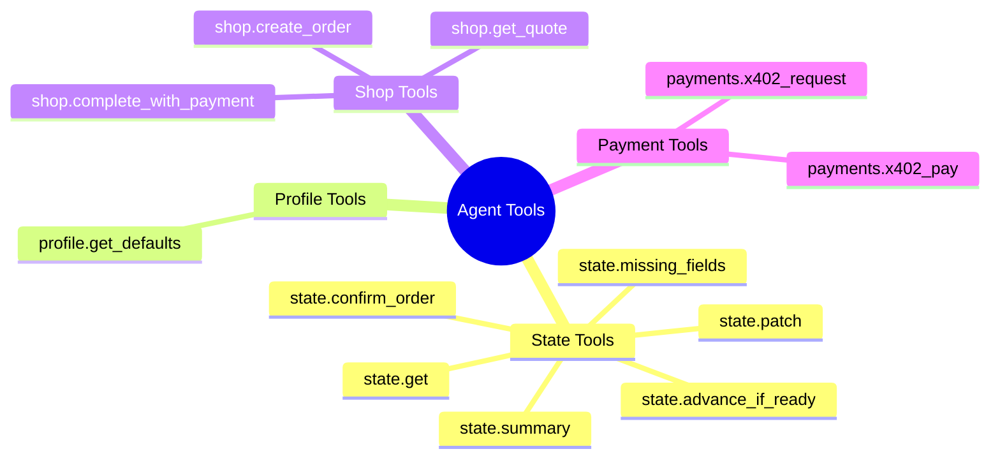
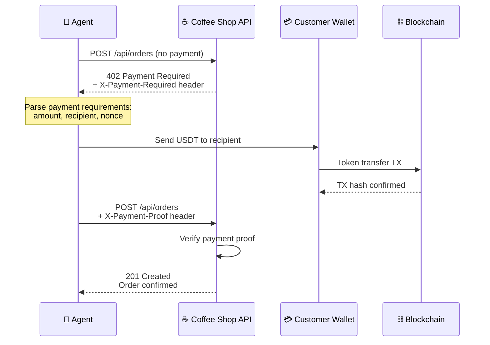
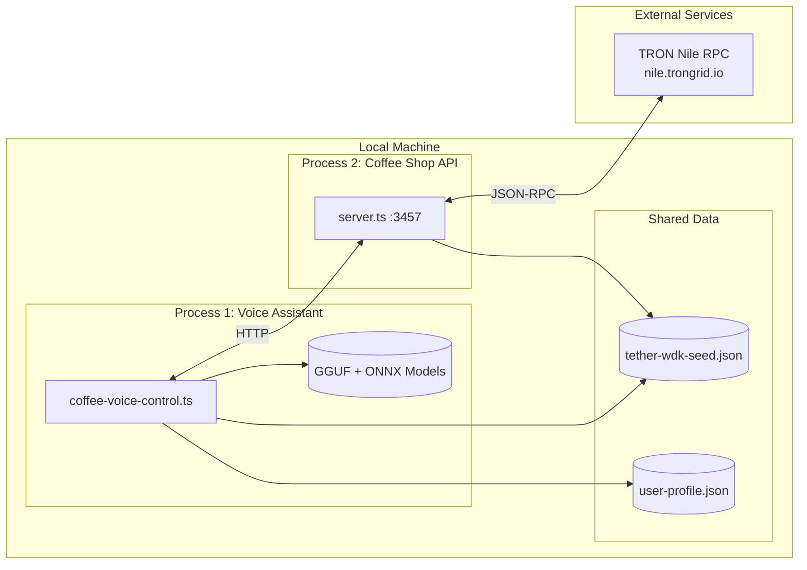
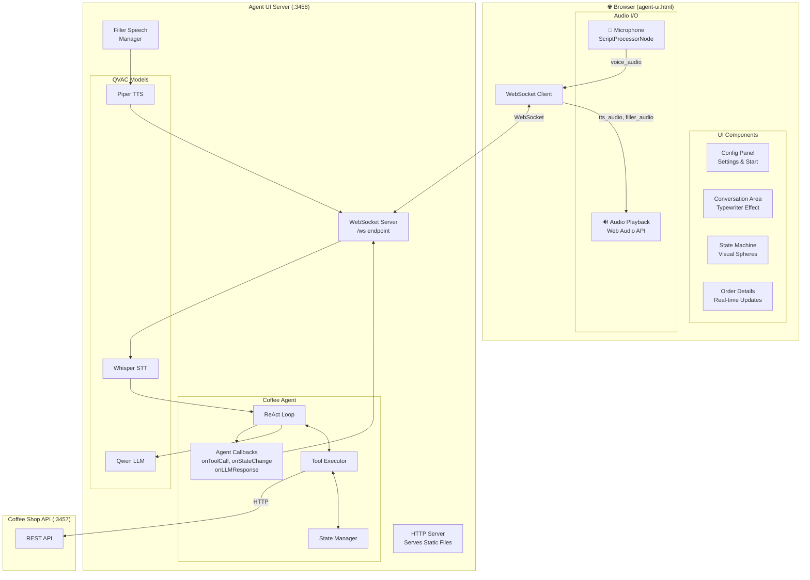
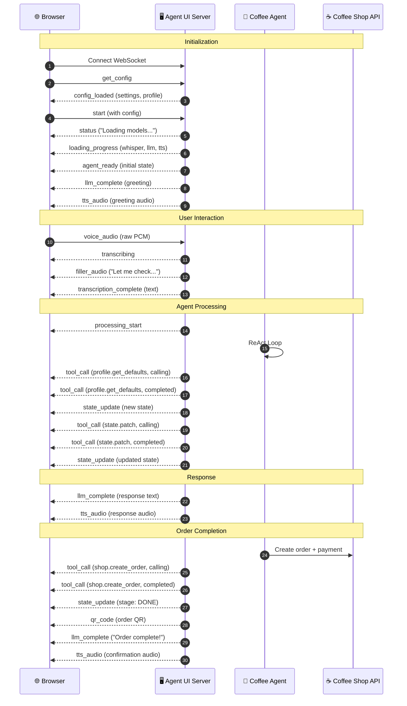
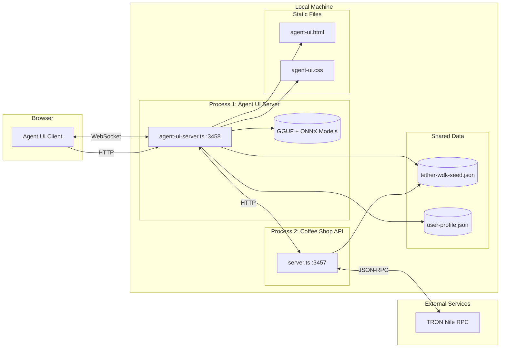

# QVAC Coffee Assistant - Architecture Diagram

This document provides visual diagrams of the system architecture and a walkthrough of a simple coffee ordering scenario.

---

## System Architecture



---

## Component Overview

| Component | Technology | Purpose |
|-----------|------------|---------|
| **Whisper** | `@qvac/sdk` | Speech-to-Text transcription |
| **Piper TTS** | ONNX model + espeak | Text-to-Speech synthesis |
| **LLM (Qwen)** | Qwen3-4B-Instruct GGUF | Natural language understanding & tool orchestration |
| **State Machine** | TypeScript | Tracks order progress through stages |
| **Tools** | TypeScript functions | Actions the LLM can invoke |
| **Customer Wallet** | Tether WDK | User's crypto wallet for payments |
| **Coffee Shop API** | Bun HTTP server | Backend for orders and shop wallet |
| **Shop Wallet** | Tether WDK (index 1) | Merchant wallet receiving payments |

---

## Simple Order Scenario - Sequence Diagram



---

## State Machine Stages



---

## Tool Categories



---

## x402 Payment Flow

The system uses the **x402 protocol** for payment-gated API access:



---

## Deployment View



---

## Quick Reference

### Start the System

```bash
# Terminal 1: Start Coffee Shop API
cd qvac-coffee-assistant
bun run server

# Terminal 2: Start Voice Assistant
cd qvac-coffee-assistant
USE_REAL_PAYMENTS=true bun run voice
```

### Environment Variables

| Variable | Default | Description |
|----------|---------|-------------|
| `USE_REAL_PAYMENTS` | `false` | Enable real blockchain transactions |
| `NETWORK_MODE` | `testnet` | Network mode (testnet/mainnet) |
| `COFFEE_SHOP_API_URL` | `http://localhost:3457` | API endpoint |
| `TTS_VOICE` | `norman` | TTS voice (norman/ryan/semaine) |

---

## Web UI Architecture

The Agent UI Server provides a browser-based interface for interacting with the coffee agent via WebSockets.



---

## WebSocket Message Flow

Real-time communication between the browser and agent server:



---

## WebSocket Message Types

| Direction | Message Type | Purpose |
|-----------|--------------|---------|
| **Client → Server** | | |
| | `get_config` | Request current configuration |
| | `start` | Initialize agent with config |
| | `user_message` | Send text message |
| | `voice_audio` | Send raw PCM audio for transcription |
| | `reset` | Reset agent to initial state |
| **Server → Client** | | |
| | `config_loaded` | Configuration and user profile |
| | `status` | Loading status message |
| | `loading_progress` | Model loading progress (%) |
| | `agent_ready` | Agent initialized, ready for input |
| | `processing_start` | Agent started processing |
| | `tool_call` | Tool execution status (calling/completed) |
| | `state_update` | Agent state changed |
| | `llm_complete` | LLM response text |
| | `tts_audio` | Base64-encoded WAV audio |
| | `filler_audio` | Filler speech audio + text |
| | `transcription_complete` | Transcribed user speech |
| | `qr_code` | Order QR code image |
| | `error` | Error message |

---

## UI Deployment View



---

## Start the Web UI

```bash
# Terminal 1: Start Coffee Shop API
cd qvac-coffee-assistant
bun run api

# Terminal 2: Start Agent UI Server
cd qvac-coffee-assistant
bun run ui

# Open browser to http://localhost:3458
```
