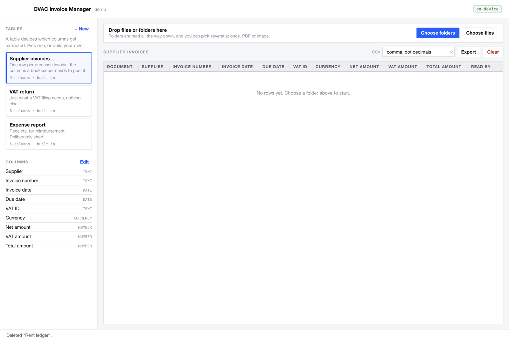

# QVAC Invoice Manager Demo

Drop a folder of invoices and receipts in, get an accounting table out. You decide which columns
exist. Nothing leaves the machine: no API key, no upload, no per-page OCR bill.



## Why this one is worth building

Invoice capture is the most boring possible AI demo and that is exactly the point. It is a job real
people pay real money for every month, the documents are commercially sensitive by nature, and the
incumbent products all work by uploading someone's supplier list, prices and bank details to a
third party. Running it on-device removes the compliance question at the source rather than
answering it.

The interesting part is not the OCR. It is that **the user defines the schema**. A bookkeeper in
France needs different columns than a freelancer filing a VAT return, and neither should have to
wait for a vendor to add a field. Here a table is just a list of columns, and the columns become a
JSON Schema the model is grammatically forced to fill.

## Run it

```bash
npm install
npm start
```

First extraction downloads a model into `~/.qvac/models/` (about 2.5 GB for the text model, about
1.8 GB for the vision one). They are lazy: a folder of text PDFs never downloads the vision model,
and a folder of scans never downloads the text one. Later runs reuse the cache.

Check the machine first if you want to be sure:

```bash
npx -y @qvac/cli doctor
```

## How it works

```
document ──► lib/reader.js ──► is there real text in here?
                                │
                     yes ───────┼─────── no
                      │                   │
              Qwen3 4B (text)      rasterise page 1 through
              + json_schema        Chromium, then
                      │            Qwen3-VL 2B + json_schema
                      └──────┬─────────────┘
                             ▼
                   lib/schema.js coerces to your column types
                             ▼
                   editable table ──► CSV
```

### Choosing the models

A **Models** button in the header opens two menus, because the app does two different jobs: one model
reads the text layer of a PDF, another looks at a scan. Each option shows its download size, whether
it is already in `~/.qvac/models` (shared with every QVAC app on the machine), a Download button when
it is not, and its **measured** score against the demo set.

Those scores were measured during development by running each candidate against
`ground-truth.json` and count correct cells. Two results are worth knowing before reaching for a
bigger model:

| Text model | correct | per doc | |
|---|---|---|---|
| Qwen3 1.7B | 70/90 | 0.9s | mangles continental decimals: `471,16` comes back as `47116` |
| **Qwen3 4B** | **90/90** | 1.9s | the default, and the only perfect score |
| Qwen3 8B | 86/90 | 3.1s | twice the size, 1.6x slower, and *worse*: it copies the label into the invoice number |

| Vision model | correct | per page | |
|---|---|---|---|
| LightOnOCR 1B | 43/72 | 3.0s | a dedicated OCR model, and the weakest here |
| **Qwen3-VL 2B** | **72/72** | 2.9s | the default: best and fastest |
| Qwen3.5-VL 4B | 68/72 | 5.1s | newer and larger, 1.7x slower, leaves some dates blank |

**Bigger is not better on this task, and the OCR model is not the right tool.** LightOnOCR is built
to transcribe a page, not to follow an instruction: asked to fill a schema it echoed the column's own
description back as the supplier name, and truncated `355,34` to `355`. A general
instruction-following vision model wins because the job is "fill these fields", not "read this page".

Re-run both benches after an SDK bump rather than trusting this table.

### Two models, and an honest note about why

Measured on the Atelier fixture during development:

| | flat PDF text | scanned image |
|---|---|---|
| Qwen3 4B (text) | **8/8 fields** | cannot see it |
| Qwen3-VL 2B (vision) | **8/8 fields** | **8/8 fields** |

An earlier version of this README claimed the vision model scored 7/8 on flat text and confused the
net amount with the total. **That was wrong.** The number had been written down before the
experiment was run, and the two models tie.

So accuracy on this document does not justify two models. The leading simplification is to drop the
text model entirely and let the VLM do both, which would also cut about 2.5 GB from the download.
It is not done yet for one reason: a single fixture is thin evidence to re-architect on, and a 2B
model has more room to degrade on long or badly scanned real invoices than a 4B one. Run the spike
over a real folder before collapsing it.

What the measurement *did* settle, and it was the risky unknown going in: `responseFormat:
json_schema` survives a vision attachment. So a scan costs exactly one call, with no separate
transcribe step.

### Structured output does the work

Each column becomes one property in a JSON Schema with `additionalProperties: false`, and the SDK
enforces it as a grammar. That removes the entire category of "the model answered in prose",
"it wrapped the JSON in a code fence", "it renamed a key". What the grammar cannot enforce is
*meaning*, so `lib/schema.js` also writes a prompt that pins the semantics a schema has no way to
express, above all net versus total.

### Scanned PDFs, with no native dependency

A scanned PDF has no text, so it has to be looked at. Electron already ships Chromium's PDF viewer,
so page 1 is loaded in an offscreen window and `capturePage()` gives a PNG. No poppler, no
ImageMagick, no node-gyp: the one heavy dependency this would otherwise need is already in the
runtime. The temp PNG is deleted in a `finally`, because these are someone's invoices.

## Traps this app already pays for

Each of these cost real debugging time. They are all encoded in the code with a comment.

| Trap | What it looks like | Where |
|---|---|---|
| Node pools small Buffers, and pdf.js reads past the view | the *same* PDF parses fine in one run and throws `bad XRef entry` in the next | `lib/reader.js`, `new Uint8Array(readFileSync(p))` |
| Two QVAC apps share one worker in `~/.qvac` | `loadModel` never resolves and never rejects, forever, with no error | `main.js` single-instance lock, plus the watchdog in `lib/extractor.js` |
| `hidden` is only a UA `display:none` | `el.hidden === true` while the modal is plainly still on screen | `[hidden]{display:none!important}` in `renderer/app.css` |
| A shared KV cache bleeds between documents | invoice 2 inherits invoice 1's supplier | `kvCache: false` per document |
| A renderer blocks `fetch` on CORS grounds | works in Node, dies in the app | the SDK lives in main only, renderer talks IPC |

## Tests

```bash
npm test               # engine: routing, schema, store, both model paths, CSV, parser, catalogue
npm run demo-data      # regenerate ~/Desktop/QVAC-invoice-demo, 55 fictional documents
```


If a test hangs with no output, check whether another QVAC app is open. They share one worker.

## Files

```
main.js              Electron main: owns the SDK, the filesystem, and the PDF rasteriser
preload.js           the only bridge, an explicit channel allow-list
lib/schema.js        columns -> JSON Schema, the prompt, and the plausibility checks
lib/models.js        the pickable models, their measured scores, and cache detection
lib/walk.js          expands files and folders into the document list, recursively
lib/reader.js        routes a file to text or vision
lib/extractor.js     the two models, lazy, with the deadlock watchdog
lib/store.js         templates + rows as JSON in userData, atomic writes
lib/csv.js           RFC 4180, with a European semicolon/comma flavour
renderer/            UI only
demo/                four documents: two text invoices, one scan-only PDF, one photo receipt
```

## Extending it

- **More than one page.** Today only page 1 of a scan is rasterised. A multi-page invoice needs
  every page captured and the images passed together, or a per-page pass merged after.
- **Line items.** The schema is flat, one row per document. Nested line items mean an `array` in the
  schema and a second table in the UI.
- **Duplicate detection.** Same supplier, same invoice number, already in the table: warn before
  adding. Cheap to do, and it is the error bookkeepers actually make.
- **Totals check.** `net + vat == total` is arithmetic, not inference. Compute it, and flag the row
  when it fails rather than trusting the model.
- **Straight to accounting software.** The CSV is the boring interchange format on purpose. A
  Pennylane, Sage or QuickBooks column mapping is a per-target template.

---

Built with the [QVAC SDK](https://github.com/tetherto/qvac). Apache 2.0.

## Disclaimer

This is a prototype and demonstration, part of the QVAC examples. It is provided as-is, with no support, no warranty and no SLA, is not maintained as a product, and is not security-audited. It exists to illustrate a use case: do not run it against real accounting records you cannot afford to check by hand. See [LICENSE](./LICENSE) for the full Apache 2.0 terms.
