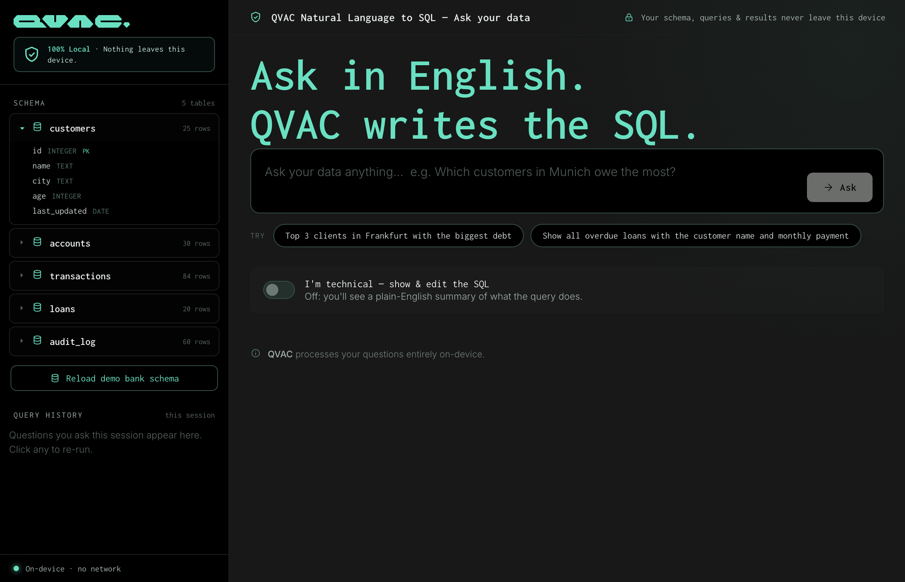
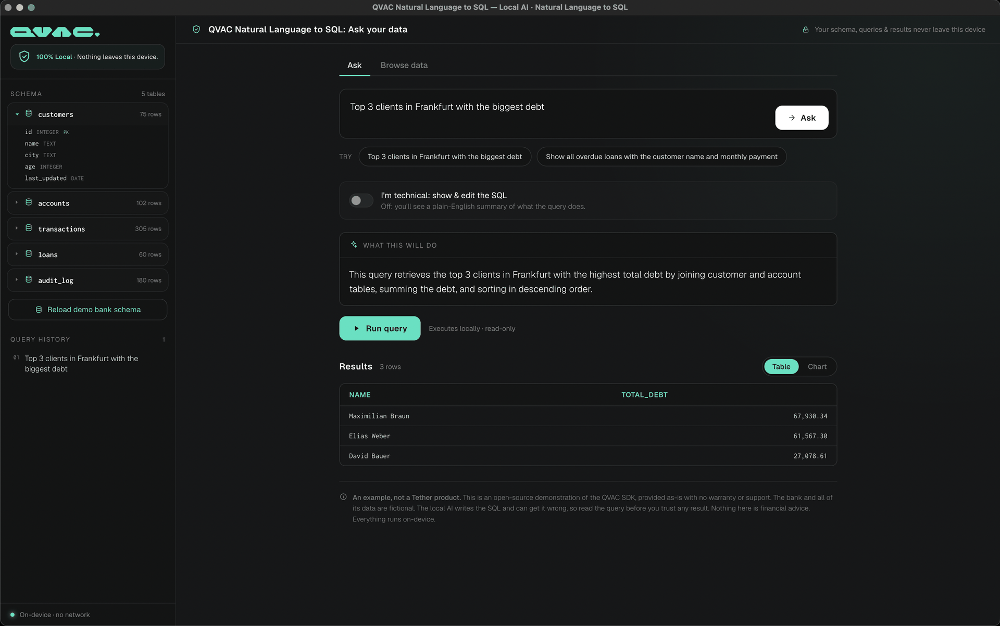
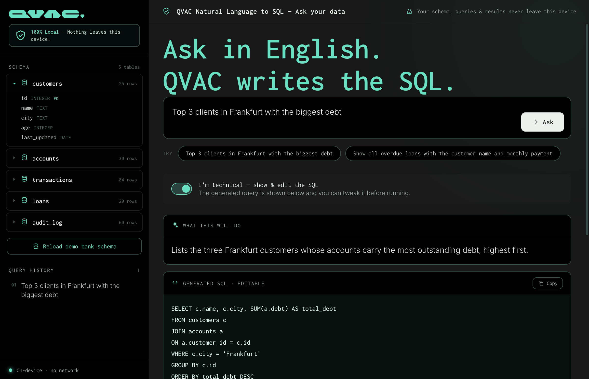

# QVAC Natural Language to SQL

Ask a banking database questions in plain English and watch a local AI write the SQL, then run it on-device against an in-memory bank. "Top 3 clients in Frankfurt with the biggest debt" becomes a real `SELECT`, executes locally, and returns rows. No cloud, no API keys for the model, no data leaving your machine.

Everything intelligent runs on your machine. The LLM (Qwen3 4B via the QVAC SDK) is 100% local: no cloud AI, no per-token cost, no prompt logging on someone else's servers. The database is a local SQLite instance running in WebAssembly, in-process. For the core experience, nothing touches the internet except the one-time model download.

> **This is an example, not a Tether product.** It is a self-contained prototype that demonstrates what the QVAC SDK makes possible. It is not an official Tether product or service, and it ships as-is, with **no support, no warranty, and no SLA**. See [About this example](#about-this-example).

## Screenshots

> **A potential look, not a fixed design.** These shots are here to give you a visual idea of where the app ends up. The [recipe](./RECIPE.md) walks through building it from scratch, so what you produce may differ slightly in layout, copy, or styling. That is expected.

**Ask in plain English.** The home screen: a question box, example prompts, and the live schema in the sidebar. The badge reassures you everything stays on-device.



**See the answer.** The model returns a plain-English summary of what the query will do; running it executes locally and shows the rows, real numbers from the in-memory bank.



**Flip on "I'm technical".** Reveal and edit the generated `SELECT` before running it. The SQL is the model's; the results come from actually executing it on-device.



## What you get

- **English to SQL, locally.** Type a question; the local Qwen3 model reads your database *schema* (never the row data) and writes a single `SELECT`. The query then runs on-device against the in-memory database and shows you the rows.
- **A realistic bank dataset.** A seeded SQLite database with five linked tables (customers, accounts, transactions, loans, and an audit log) across several German cities. Enough structure to ask interesting questions (debt, overdue loans, balances, joins) without any real customer data.
- **"I'm technical" mode.** Off by default, you get a plain-English summary of what the query does. Flip it on to see and *edit* the generated SQL before running it.
- **Read-only by design.** Anything that mutates data (`DELETE`, `DROP`, `UPDATE`, `INSERT`, `ALTER`, `PRAGMA`, and more) is blocked before it ever reaches the engine. This demo only reads.
- **Query history.** Recent questions, their SQL, and explanations are kept in the session so you can re-run them with one click.
- **Privacy you can see.** The schema and your question are the only things the model ever receives. The data lives in the renderer's memory; the app is served from a `127.0.0.1`-only static server that isn't reachable from the network.

## Why local AI matters here

Banking data is exactly the kind of data you can't paste into a cloud chatbot. A natural-language-to-SQL assistant is genuinely useful for analysts and support staff, but only if the question, the schema, and the results never leave the building. Running the model on-device removes the compliance problem at the root: there is no outbound request to review, no third-party data-processing agreement, no token bill. This example is a small, honest demonstration of that pattern.

## Requirements

- **Node.js 22.17 or higher**
- A **GPU-capable machine** (macOS Apple Silicon, Linux with Vulkan, or Windows with Vulkan). CPU fallback works but is slow.
- **~3 GB free disk** for the model cache (Qwen3 4B Q4_K_M, downloaded and cached on first run)
- An **internet connection on first run**, only to download the model (about 3 GB), which is cached afterwards. The front-end libraries (React, sql.js) are vendored locally, so nothing else touches the network; see [Running fully offline](#running-fully-offline).

Check your machine first (the doctor command lives in the separate `@qvac/cli` package, not in the SDK):

```bash
npx -y @qvac/cli doctor
```

## Recommended hardware

Everything runs on your machine. The first run downloads the model once (about 2.5 GB) into a shared `~/.qvac` cache, then it works fully offline.

|           | Minimum                          | Recommended                                               |
| --------- | -------------------------------- | --------------------------------------------------------- |
| RAM       | 8 GB                             | 16 GB                                                     |
| Free disk | ~2.5 GB (one-time model download) |                                                          |
| GPU       | works on CPU (slower)            | Apple Silicon (Metal), or a Vulkan GPU on Windows / Linux |
| OS        | macOS 13+, Windows 10+, or Linux |                                                           |
| Runtime   | Node.js 22.17+                   |                                                           |

Model downloaded on first run (cached in `~/.qvac`, about 2.5 GB):

- **Qwen3-4B Instruct**, Q4_K_M, ~2.5 GB. Turns your plain-English question plus the database schema into a single `SELECT` query. Only the schema is sent to the model, never the row data.

## Quickstart

```bash
npm install
npm start
```

A desktop window opens. The first question triggers a one-time model download and load (a few minutes, cached afterwards); the status banner shows progress. Once the model is ready, type a question, or tap one of the example chips, and hit **Ask**, then **Run query**.

Try:

- *Top 3 clients in Frankfurt with the biggest debt*
- *Show all overdue loans with the customer name and monthly payment*
- *Which customers in Munich owe the most?*

## How it works (and what it is not)

- The app is an **Electron** desktop app. The local model (Qwen3 4B Q4_K_M) is loaded in the **main process** via `@qvac/sdk` and exposed to the UI over a narrow IPC bridge: a `generateSQL(prompt)` call, plus model-loading progress and a model-status query. Nothing else crosses the boundary.
- The database is **SQLite compiled to WebAssembly** (`sql.js`), seeded in memory when the app starts. Every query executes in-process; there is no database server and no network call.
- For each question, the app builds a prompt from the **schema plus your question** and asks the model to reply with JSON: a `SELECT` query and a one-sentence explanation. **Row data is never sent to the model**, only the table/column shapes.
- The returned SQL is checked against a read-only guard *before* it runs. Mutating statements are refused.
- The model writes SQL; it does **not** invent results. The numbers you see are produced by executing the query against the local database.

This is a demo of local-AI orchestration over a realistic schema. It is not a production query tool, not financial software, and not advice. Generated SQL can be wrong or suboptimal; that is why technical mode lets you read and edit it before running.

## The sample data

A self-contained, fictional dataset seeded deterministically and entirely on-device (the demo's "today" is 2026-06-08):

| Table          | Rows | What's in it                                              |
| -------------- | ---- | --------------------------------------------------------- |
| `customers`    | 75   | name, city, age, last KYC refresh                         |
| `accounts`     | 102  | checking/savings, balance, outstanding debt (EUR)         |
| `transactions` | 305  | deposits, withdrawals, transfers, fees                    |
| `loans`        | 60   | mortgage/personal/auto; principal, rate, status, due date |
| `audit_log`    | 180  | login, export, admin, and flagged-activity events         |

It contains **no real people, accounts, or credentials**. It exists only to make the natural-language queries interesting, and it is not modeled on any real bank.

## Running fully offline

The only network request the app ever makes is the one-time model download, which is cached after the first run. Everything else is local:

- `npm start` first runs `npm run build` (`scripts/build.js`), which **vendors** the front-end libraries (`sql.js` WASM plus the production React / React-DOM builds) into `renderer/vendor/` and **pre-transpiles** the JSX to plain JavaScript, so the browser loads no CDN scripts and never runs Babel at runtime.
- The renderer is served from a `127.0.0.1`-only static server, and the sql.js WASM is resolved from `renderer/vendor/`.

So after the model is cached, the app works with the network fully disconnected.

## About this example

This app lives in [`qvac-examples`](https://github.com/tetherto/qvac-examples), Tether's open-source collection of focused prototypes that show what the QVAC SDK can do with local AI. It is:

- **An example, not a Tether product.** Small, readable, and meant to be run from clean. It is not customer-facing software and not an official Tether product or service.
- **Unsupported.** Provided as-is, with no support, warranty, or guarantees. Issues and questions may not receive a response.
- **A starting point.** Fork it, read it, adapt it. The point is to make the local-AI pattern concrete.

## License

Code licensed under the Apache License, Version 2.0. See [LICENSE](./LICENSE).

This example depends on `@qvac/sdk`, `electron`, and `sql.js`; using it is subject to each of their respective licenses.
